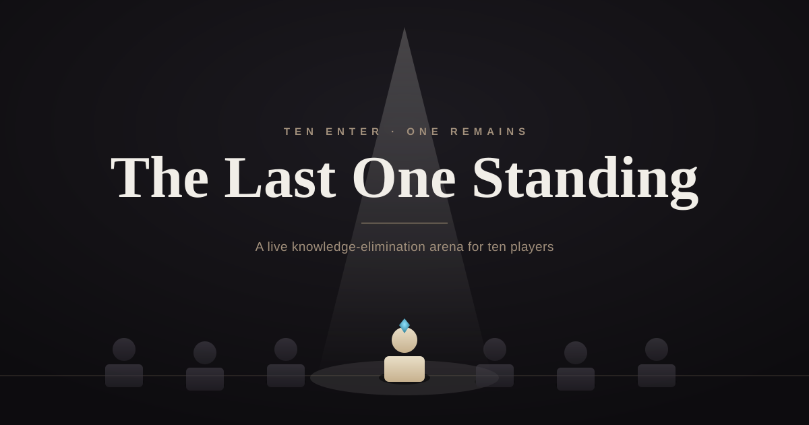

<div align="center">

# 🏛️ The Last One Standing

### A live knowledge-elimination arena for 10 players.
**Ten enter. One remains.**



<!-- Live demo + demo video -->
### [▶ Play the Live Demo](https://last-one-standing-game.replit.app) &nbsp;·&nbsp; [🎬 Watch the Demo Video](https://canva.link/lastonestandinggamev1)

Built with React · TypeScript · Vite · WebSocket · Web Audio API

</div>

---

## What is it

**The Last One Standing** is a live, host-controlled quiz built to be played *in the room, together* — one big screen for the audience, one control panel for the host. It's not a solo web quiz: it's a theatrical elimination show where ten players fight through escalating rounds until a single ruler of knowledge remains.

It runs as two synchronized screens that talk to each other in real time over WebSocket:

| 🎛️ **Host Panel** | 📺 **Audience View** |
|---|---|
| The control room. Draw questions, reveal answers, award points, take lives, trigger effects. Works on desktop *and* phone. | The show. A cinematic dark arena with player figurines, life crystals, spotlights, and sound — updates instantly the moment the host acts. |

Open the Audience View on a projector or TV, open the Host Panel on a laptop or phone, and you have a full game-show stage.

---

## Not just a demo — it ships

This wasn't built only for the Designathon. It's a real internal training tool, deployed at company **improvement days** across four manufacturing plants in Poland — running **8 live sessions over 4 days per site, a different plant each week.**

The questions are technical, drawn from real corporate knowledge, so the game does three things at once: it **teaches**, it **tests** what people actually know, and it turns a training session into a team game that people want to play. It's designed to **support the host**, not replace them — the host runs the show from one panel while the room plays along together.

So this repo isn't a hackathon throwaway. It's a product that had to survive contact with a real audience, real presenters, and real projectors in a real room.

---

## How it plays

Ten players start with **2 lives** each. The host runs four escalating rounds:

| Round | Type | Points |
|---|---|---|
| 🟢 **Warm Up** | True / False | +1 |
| 🟡 **Survival** | True / False | +2 |
| 🟠 **Mandatory** | Open questions | +3 |
| 🔴 **Battle** | Open questions | +5 |

A wrong answer cracks a life crystal. Lose both, and your platform sinks — you're out. The spotlight moves to the next player, the tension builds, and the board narrows round after round until **one player is left standing.**

---

## Features

- **True cross-device sync** — Host and Audience run on separate machines and stay perfectly in step over a WebSocket room. A short room code pairs them; a server-issued owner token keeps control locked to the real host, even across reconnects.
- **Cinematic arena** — a hand-built dark stage with spotlight ignition, dormant-to-active player figurines, life crystals, and sinking platforms. Shared design tokens make the landing page feel like the same room as the game.
- **Full sound design** — a Web Audio engine with an ambient arena drone, hover/click UI sounds, a brass fanfare for correct answers, and a dissonant hit for wrong ones — all routed through the server so effects fire on every screen at once.
- **Voice narration for every question** — 200 questions pre-generated to speech with ElevenLabs, played automatically on the Audience screen so the host never has to read aloud.
- **Mobile host panel** — the control panel collapses to a bottom tab bar (Controls / Question / Players) and is fully usable from a phone.
- **Load your own questions** — drop in an Excel file and the game loads your question set; the server persists it so it survives a refresh.

---

## Tech stack

| Layer | Tech |
|---|---|
| Frontend | React · TypeScript · Vite · Tailwind CSS · Framer Motion |
| Real-time | WebSocket (`ws`) with in-memory rooms + owner-token auth |
| Audio | Web Audio API (synthesized SFX) · ElevenLabs (pre-generated narration) |
| Backend | Express · Node 20 |
| Data | Drizzle ORM · PostgreSQL (optional) · Excel question import |
| Hosting | Replit (autoscale deployment) |

---

## Run it locally

```bash
# 1. Install
npm install

# 2. Start the dev server (client + server together)
npm run dev

# App runs on http://localhost:5000
```

Then open **two** tabs:
- `/admin` — the Host Panel
- `/audience` — the Audience View (put this on the big screen)

Create a room in the Host Panel, join it from the Audience View with the room code, and you're live.

```bash
npm run build   # production build
npm run start   # run the production server
npm run check   # type-check
```

---

## Project structure

```
client/          React front end
  src/pages/     home · admin (host) · audience
  src/components/arena/   Arena, Spotlight, PlayerFigurine, LifeCore, PlayerPlatform
  src/lib/       arena-audio · game-state · excel-loader
  public/audio_questions/   200 pre-generated narration clips
server/          Express + WebSocket (rooms, effect fan-out, question persistence)
shared/          shared types & schema
scripts/         ElevenLabs TTS pre-generation
```

---

<div align="center">

Built for the **Replit Designathon** — and for real deployment at live company training events.

*Ten enter. One remains.*

</div>
